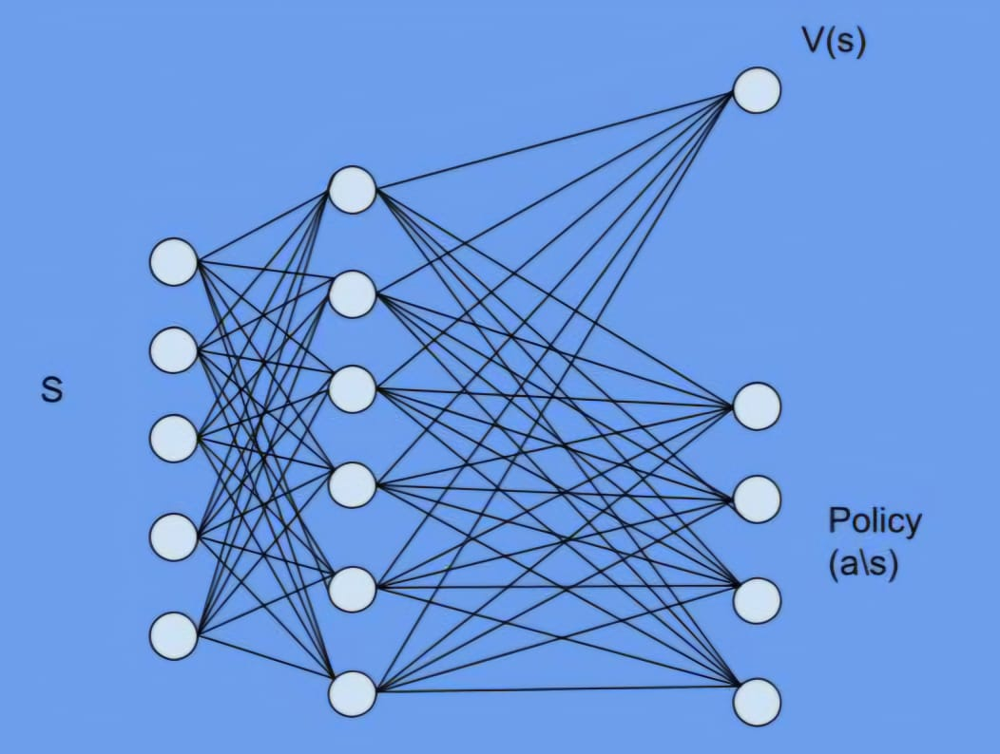

# 🧠 A2C — Advantage Actor–Critic Reinforcement Learning

- A2C (Advantage Actor–Critic) is one of the most widely used policy gradient methods in Reinforcement Learning.
It combines the advantages of policy-based (stochastic exploration) and value-based (stability via baselines) approaches.

- This repository implements A2C from scratch using PyTorch, featuring both the actor (policy) and critic (value) updates.
# Architecture:-

- The setup requires two networks, one for parameterized representation of the policy and he other for the for the Value estimates of the state.
- The network has total 3 layers.Instead of having 2 separate networks to learn policy and value, The first two layers (input layers and hidden layers) are merged while keeping the final layer with two separate heads.
- The network has one hidden layer.Input dimension is as same as the dimension of state space and it has 2 output heads, one for the policy with the dimension of action space and the other to represent value of the state

# 🚀 Overview

- A2C stands for Advantage Actor–Critic — a synchronous variant of the original A3C (Asynchronous Advantage Actor–Critic) algorithm.
- It uses multiple environments running in parallel to collect trajectories, compute advantages, and perform policy gradient and value updates.
- A2C improves stability, sample efficiency, and convergence speed compared to vanilla policy gradients.

# Summary

Here we start by considering the objective function to maximize the estimated Reward while interacting with the stochastic environment. Then we move along the direction of the gradient of the reward estimate function.
The Monte Carlo estimates as the reward function, leads to REINFORCE, But the need to reduce the variance is the primary motive to Actor Critic method where we reduce the policy variance by learning the estimated value of the state parallely
